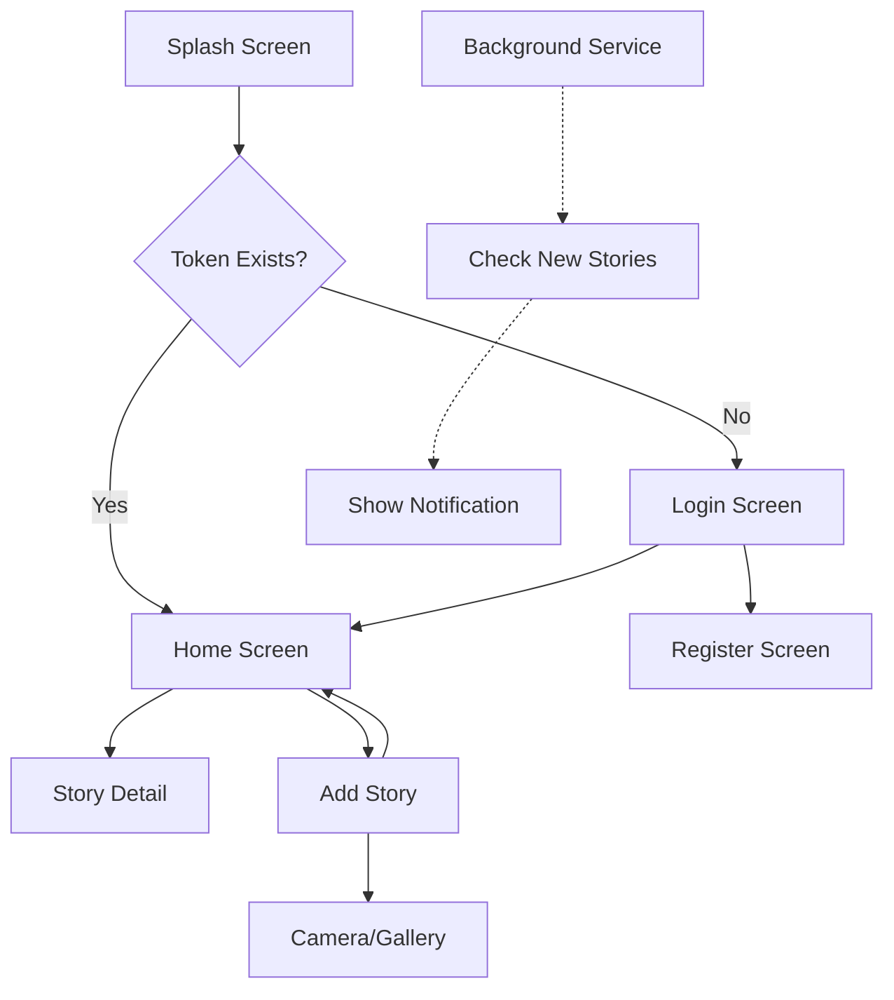

# 📖 Dicoding Story App

> A modern Flutter application for sharing and exploring stories with multilingual support and smart notifications

## 📱 Screenshots

<table>
  <tr>
    <td></td>
    <td></td>
    <td></td>
    <td></td>
  </tr>
  <tr>
    <td align="center">Splash Screen</td>
    <td align="center">Login Screen</td>
    <td align="center">Stories List</td>
    <td align="center">Add Story</td>
  </tr>
</table>

## ✨ Features

### 🌟 Core Features

- **Story Sharing**: Upload and share stories with images
- **Story Discovery**: Browse stories from other users with real-time timestamps
- **User Authentication**: Secure login and registration system
- **Multilingual Support**: Switch between English and Indonesian (Bahasa Indonesia)
- **Smart Notifications**: Background notifications for new stories

### 🔔 Notification Features

- **Toggle Notifications**: Enable/disable notifications with user-friendly toggle
- **Background Processing**: Continues to check for new stories even when app is closed
- **Permission Handling**: Smart Android 13+ notification permission requests
- **Localized Messages**: Notification messages in user's preferred language

### 🌐 Internationalization

- **Language Switching**: Real-time language switching with toggle button
- **Localized UI**: All interface elements translated (EN/ID)
- **Smart Date Formatting**: Context-aware relative time formatting
  - English: "5 minutes ago", "2 hours ago", "Just now"
  - Indonesian: "5 menit yang lalu", "2 jam yang lalu", "Baru saja"

## 🏗️ Architecture

### 📁 Project Structure

```
lib/
├── main.dart                     # App entry point with service initialization
├── l10n/                        # Localization files
│   └── app_localizations.dart   # Translation system
├── models/                      # Data models
│   └── story.dart              # Story data structure
├── providers/                   # State management (Provider pattern)
│   ├── session_provider.dart   # Authentication state
│   ├── story_provider.dart     # Story data management
│   ├── locale_provider.dart    # Language preferences
│   └── notification_provider.dart # Notification settings
├── services/                    # Business logic & external services
│   ├── story_service.dart       # API communication
│   ├── notification_service.dart # Local notifications
│   ├── permission_service.dart  # Runtime permissions
│   └── background_service.dart  # Background task management
├── screens/                     # UI screens
│   ├── splash_screen.dart       # Loading screen
│   ├── login_screen.dart        # Authentication
│   ├── home_screen.dart         # Stories list
│   └── add_story_screen.dart    # Story creation
├── widgets/                     # Reusable UI components
└── utils/                       # Helper functions
    └── date_time_utils.dart     # Localized date formatting
```

### 🔄 App Flow



## 🛠️ Technologies & Packages

### 🎯 Core Framework

- **Flutter**: ^3.7.2 - Cross-platform mobile development
- **Dart**: SDK for Flutter development

### 📦 Key Dependencies

#### State Management & Navigation

```yaml
provider: ^6.1.5 # State management pattern
go_router: ^15.1.3 # Declarative routing
```

#### Networking & Storage

```yaml
http: ^1.4.0 # HTTP client for API calls
shared_preferences: ^2.5.3 # Local data persistence
```

#### Notifications & Background Processing

```yaml
flutter_local_notifications: ^19.2.1 # Local notifications
workmanager: ^0.6.0 # Background task management
permission_handler: ^12.0.0+1 # Runtime permissions
```

#### UI & Media

```yaml
image_picker: ^1.1.2 # Camera & gallery access
flutter_localizations: sdk # Internationalization support
intl: ^0.19.0 # Date formatting & localization
```

## 🚀 Getting Started

### Prerequisites

- Flutter SDK (^3.7.2)
- Android Studio / VS Code
- Android device or emulator (API level 21+)

### Installation

1. **Clone the repository**

   ```bash
   git clone https://github.com/your-username/dicoding_story_app.git
   cd dicoding_story_app
   ```

2. **Install dependencies**

   ```bash
   flutter pub get
   ```

3. **Run the app**
   ```bash
   flutter run
   ```

### 🔧 Configuration

#### Android Permissions

The app requires these permissions (automatically handled):

```xml
<uses-permission android:name="android.permission.INTERNET"/>
<uses-permission android:name="android.permission.RECEIVE_BOOT_COMPLETED"/>
<uses-permission android:name="android.permission.WAKE_LOCK"/>
<uses-permission android:name="android.permission.VIBRATE" />
<uses-permission android:name="android.permission.POST_NOTIFICATIONS"/>
<uses-permission android:name="android.permission.FOREGROUND_SERVICE" />
```

## 📱 User Journey

### 1. **Authentication Flow**

- Splash screen with app branding
- Language selection (EN/ID)
- Login with email/password
- Registration for new users

### 2. **Main App Experience**

- **Home Screen**: Stories list with real-time timestamps
- **Language Toggle**: Switch between English and Indonesian
- **Notification Control**: Enable/disable background notifications
- **Story Creation**: Camera or gallery image selection with description

### 3. **Background Features**

- **Smart Notifications**: Automatic checks every 15 minutes
- **Permission Management**: Seamless Android 13+ permission handling
- **Battery Optimization**: Efficient background processing

## 🌍 Localization

### Supported Languages

- **English (EN)**: Default language
- **Indonesian (ID)**: Bahasa Indonesia

### Localized Elements

- UI text and labels
- Date and time formatting
- Notification messages
- Relative time expressions

## 🔔 Notification System

### Features

- **Local Notifications**: No server dependency
- **Background Processing**: Works when app is closed
- **Smart Scheduling**: Checks for new stories every 15 minutes
- **Battery Efficient**: Uses Android WorkManager
- **Permission Aware**: Handles Android 13+ restrictions

### How It Works

1. User enables notifications via toggle
2. Background service registers with Android WorkManager
3. Service periodically checks for new stories
4. Displays notification when new content is available
5. Respects user preferences and device limitations

## 🏆 Best Practices Implemented

### Code Architecture

- **Provider Pattern**: Clean state management
- **Service Layer**: Separated business logic
- **Model-View-Provider**: Clear separation of concerns

### User Experience

- **Responsive Design**: Adapts to different screen sizes
- **Loading States**: Clear feedback during operations
- **Error Handling**: Graceful error recovery
- **Offline Awareness**: Handles network issues

### Performance

- **Image Optimization**: Compressed image uploads
- **Efficient Notifications**: Battery-conscious background processing
- **Memory Management**: Proper resource cleanup

## 🤝 Contributing

1. Fork the repository
2. Create your feature branch (`git checkout -b feature/amazing-feature`)
3. Commit your changes (`git commit -m 'Add some amazing feature'`)
4. Push to the branch (`git push origin feature/amazing-feature`)
5. Open a Pull Request

## 📄 License

This project is licensed under the MIT License - see the [LICENSE](LICENSE) file for details.

## 📞 Contact

**Developer**: Your Name  
**Email**: your.email@example.com  
**GitHub**: [@your-username](https://github.com/your-username)

---

<div align="center">
  <p>Made with ❤️ using Flutter</p>
  <p>
    
    
    
  </p>
</div>
